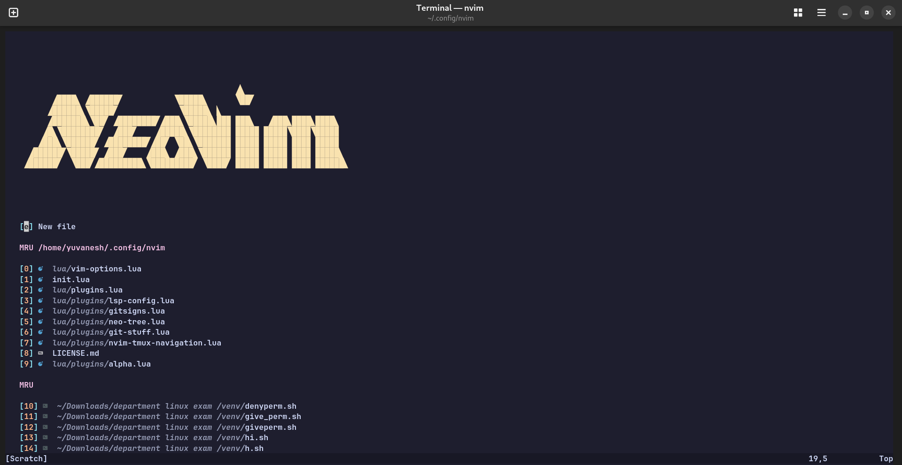
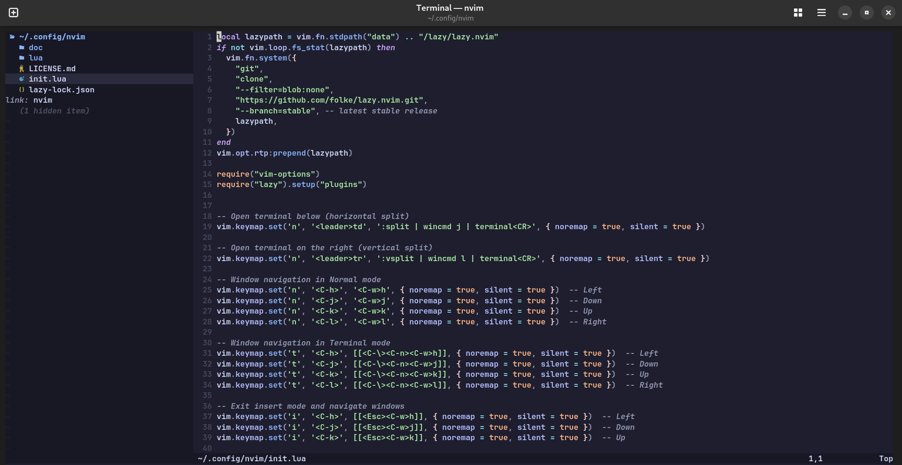
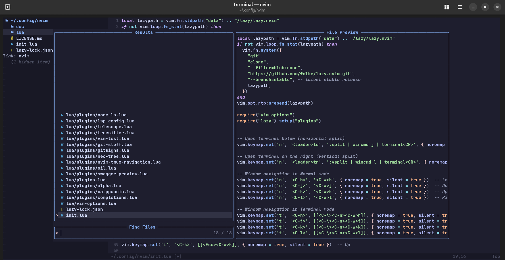
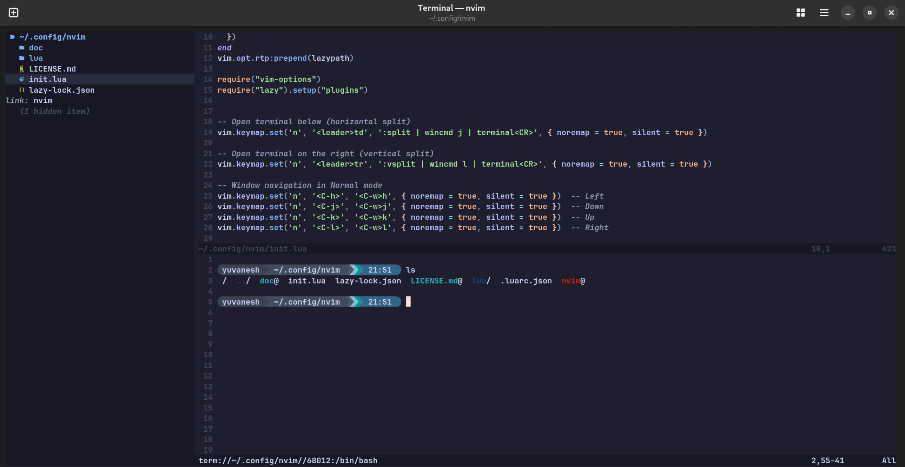

# Project Name
## Overview
This project is a modular and highly customizable Neovim configuration written in Lua. It leverages the latest Neovim plugins and features to provide a modern, efficient, and enjoyable development experience.
---
## Features
- **Highly Modular Design**: Organized plugin and configuration files for easy management and customization.
- **Intuitive File Navigation**: Includes plugins like `neo-tree`, `telescope`, and `oil.nvim` for powerful file and project navigation.
- **Beautiful UI**: Enhanced aesthetics with `catppuccin` theme.
- **Advanced Git Integration**: Seamless Git workflows using `gitsigns` and custom scripts (`git-stuff`).
- **Language Server Protocol (LSP)**: Rich LSP support via `lsp-config`, enabling IDE-like features such as auto-completion and diagnostics.
- **Treesitter Integration**: Enhanced syntax highlighting and code manipulation with `treesitter`.
- **Code Formatting & Linting**: Configured with `none-ls` for on-the-fly code quality checks.
- **Swagger Support**: Integrated `swagger-preview` for API documentation.
- **Test Automation**: Simplified test execution with `vim-test`.
- **Seamless Tmux Navigation**: Effortless workflow between Neovim and Tmux using `nvim-tmux-navigation`.
- **Lightweight File Explorer**: Integrated `oil` for quick and simple file exploration.
- **Smart Code Commenting**: Easy code commenting with `Comment.nvim`.
---
## File Structure
```plaintext
.
├── structure
│   └── lua
│       └── plugins
│           ├── alpha.lua
│           ├── catppuccin.lua
│           ├── completions.lua
│           ├── comment.lua
│           ├── git-stuff.lua
│           ├── gitsigns.lua
│           ├── lsp-config.lua
│           ├── neo-tree.lua
│           ├── none-ls.lua
│           ├── nvim-tmux-navigation.lua
│           ├── oil.lua
│           ├── swagger-preview.lua
│           ├── telescope.lua
│           ├── treesitter.lua
│           └── vim-test.lua
├── .gitattributes
├── .luarc.json
├── LICENSE
├── README.md
├── init.lua
├── lazy-lock.json
└── plugins.lua
```
---
## Prerequisites
Ensure you have the following installed:
- **Neovim**: Version 0.9.0 or later.
- **Node.js**: Required for LSP servers and Treesitter parsers.
- **Git**: For managing plugins and version control.
- **Tmux** (optional): For seamless navigation between Neovim and terminal panes.
---
## Installation
1. Clone this repository into your Neovim configuration directory:
   ```bash
   git clone https://github.com/your-username/your-repo-name.git ~/.config/nvim
   ```
2. Open Neovim and run the following command to install plugins:
   ```vim
   :Lazy sync
   ```
3. Restart Neovim, and you're ready to go!
---
## Configuration
### Plugins
All plugin configurations are located under `lua/plugins/`. You can easily enable, disable, or customize plugins by editing these files.
### Keybindings
Keybindings are defined within individual plugin configurations and the `init.lua` file. Modify them to suit your workflow.
### Themes
Change the theme by modifying the `catppuccin.lua` file or replacing it with your preferred color scheme.
---
## Keyboard Shortcuts

### Navigation

| Shortcut | Action | Description |
|----------|--------|-------------|
| `<C-h>` | Navigate Left | Move cursor to the left window |
| `<C-j>` | Navigate Down | Move cursor to the window below |
| `<C-k>` | Navigate Up | Move cursor to the window above |
| `<C-l>` | Navigate Right | Move cursor to the right window |

### Window Navigation

#### Normal Mode
| Shortcut | Action | Description |
|----------|--------|-------------|
| `<C-h>` | Navigate Left | Move to the left window |
| `<C-j>` | Navigate Down | Move to the window below |
| `<C-k>` | Navigate Up | Move to the window above |
| `<C-l>` | Navigate Right | Move to the right window |

#### Terminal Mode
| Shortcut | Action | Description |
|----------|--------|-------------|
| `<C-h>` | Navigate Left | Exit terminal mode and move to the left window |
| `<C-j>` | Navigate Down | Exit terminal mode and move to the window below |
| `<C-k>` | Navigate Up | Exit terminal mode and move to the window above |
| `<C-l>` | Navigate Right | Exit terminal mode and move to the right window |

#### Insert Mode
| Shortcut | Action | Description |
|----------|--------|-------------|
| `<C-h>` | Navigate Left | Exit insert mode and move to the left window |
| `<C-j>` | Navigate Down | Exit insert mode and move to the window below |
| `<C-k>` | Navigate Up | Exit insert mode and move to the window above |

### File Explorer

| Shortcut | Action | Description |
|----------|--------|-------------|
| `<C-n>` | Open File Explorer | Opens Neo-tree file explorer on the left side |
| `<leader>bf` | Open Buffer Explorer | Shows current buffers in a floating window |

#### Oil.nvim
| Shortcut | Action | Description |
|----------|--------|-------------|
| `-` | Toggle Oil | Open/close the Oil file explorer in a floating window |

#### Telescope
| Shortcut | Action | Description |
|----------|--------|-------------|
| `<C-p>` | Find Files | Open Telescope file finder |
| `<leader>fg` | Live Grep | Search for text in all files (requires ripgrep) |
| `<leader><leader>` | Recent Files | Browse recently opened files |

### Git Integration

| Shortcut | Action | Description |
|----------|--------|-------------|
| `<leader>gp` | Git Preview Hunk | Shows the git diff for the current hunk |
| `<leader>gt` | Toggle Git Blame | Toggles inline git blame for the current line |

### Commenting

| Shortcut | Action | Description |
|----------|--------|-------------|
| `gc` | Toggle Comment | Comment or uncomment selected lines (Comment.nvim) |
| `gcc` | Toggle Line Comment | Comment or uncomment current line |
| `gcap` | Comment Paragraph | Comment or uncomment the current paragraph |

### LSP (Language Server Protocol)

| Shortcut | Action | Description |
|----------|--------|-------------|
| `K` | Show Hover Information | Display documentation for the symbol under cursor |
| `<leader>gd` | Go to Definition | Jump to the definition of the symbol under cursor |
| `<leader>gr` | Find References | List all references to the symbol under cursor |
| `<leader>ca` | Code Actions | Show available code actions for current context |

### Testing (vim-test)
| Shortcut | Action | Description |
|----------|--------|-------------|
| `<leader>t` | Test Nearest | Run the test nearest to the cursor |
| `<leader>T` | Test File | Run all tests in the current file |
| `<leader>a` | Test Suite | Run the entire test suite |
| `<leader>l` | Test Last | Run the last test again |
| `<leader>g` | Test Visit | Go to the test file that was last run |

### Terminal Integration
| Shortcut | Action | Description |
|----------|--------|-------------|
| `<leader>td` | Open Terminal Below | Open terminal in a horizontal split below |
| `<leader>tr` | Open Terminal Right | Open terminal in a vertical split to the right |

### Autocomplete (nvim-cmp)

| Shortcut | Action | Description |
|----------|--------|-------------|
| `<C-Space>` | Trigger Completion | Show completion suggestions |
| `<C-e>` | Cancel Completion | Close the completion menu |
| `<CR>` (Enter) | Confirm Selection | Select the highlighted completion item |
| `<C-b>` | Scroll Docs Up | Scroll up in the documentation popup |
| `<C-f>` | Scroll Docs Down | Scroll down in the documentation popup |

### Miscellaneous
| Shortcut | Action | Description |
|----------|--------|-------------|
| `<leader>h` | Clear Search Highlight | Clear search highlighting |

---
## Contributing
Contributions are welcome! If you have ideas for new features or improvements, feel free to open an issue or submit a pull request.
---
## License
This project is licensed under the [MIT License](LICENSE).
---
## Acknowledgments
- [Neovim](https://neovim.io/)
- [Lazy.nvim](https://github.com/folke/lazy.nvim)
- [Catppuccin Theme](https://github.com/catppuccin/nvim)
- The open-source community for their incredible tools and inspiration.
---
## Screenshots
### Neovim Dashboard

### File Explorer (Neo-tree)

### Telescope Integration

### Terminal 

---
## Author
Developed by **[Yuvaneshwarran R](https://github.com/yuvaneshwarran)**. Feel free to reach out for questions or collaboration!
